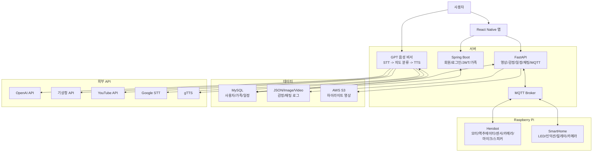

# Kairos

Kairos는 음성 대화, 감정 인식, 실시간 영상, 일정 관리, 가족 채팅, IoT 제어를 하나로 연결한 AI 홈 로봇/스마트홈 프로젝트입니다. React Native 앱, Spring Boot 인증 서버, FastAPI AI/비전 서버, GPT 음성 비서, MQTT 기반 Raspberry Pi 로봇/스마트홈 장치로 구성되어 있습니다.

## 주요 기능

- 회원가입, 로그인, JWT access/refresh 토큰 재발급
- 가족 요청, 수락, 거절, 가족 목록 조회 및 삭제
- 모바일 앱에서 로봇 이동, 속도 조절, 영상 스트리밍 확인
- MQTT 기반 Herobot 모터, 액추에이터, 초음파 거리 센서, 카메라, TTS 제어
- 스마트홈 LED, 인덕션, 릴레이 제어 및 카메라 프레임 송신
- 얼굴 인식, 감정 분석, 손동작 인식, 감정 대표 이미지 저장
- 감정 변화 기반 하이라이트 영상 생성 및 AWS S3 업로드
- 가족 단위 일정 추가, 조회, 삭제
- WebSocket 기반 가족 채팅 및 메시지 JSON 로그 저장
- 호출어 기반 GPT 음성 비서: 일정, 날씨, 음악 재생, 스마트홈 제어, 일반 대화

## 기술 스택

| 영역 | 기술 |
| --- | --- |
| Mobile | React Native, Expo, React Navigation, AsyncStorage |
| Backend | Java 21, Spring Boot 3.3.1, Spring Security, JPA, JWT, MySQL |
| AI/API | Python, FastAPI, Uvicorn, OpenCV, DeepFace, MediaPipe, TensorFlow/Keras |
| Voice/GPT | OpenAI API, Google Speech Recognition, gTTS, YouTube Data API, 기상청 단기예보 API |
| IoT | Raspberry Pi, GPIO, gmqtt, MQTT, camera, ultrasonic sensor |
| Cloud/Storage | AWS S3, MySQL/Azure Database |

## 시스템 구조



## 디렉터리 구조

```text
Kairos/
├── Backend/                 # Spring Boot 서버
│   └── src/main/java/com/project/back/
│       ├── config/          # Spring Security, CORS 설정
│       ├── controller/      # 회원, 가족, 사용자 API
│       ├── dto/
│       ├── entity/
│       ├── jwt/             # JWT 필터, 로그인, 재발급, 로그아웃
│       ├── repository/
│       └── service/
├── Backend_separation/      # FastAPI AI/비전/MQTT 서버
│   ├── app.py               # FastAPI 엔트리포인트
│   ├── mqtt_client.py       # robot/* 토픽 연동
│   ├── face_recognition.py  # 얼굴/감정 인식
│   ├── hand_gesture_recognition.py
│   ├── calendar_app.py      # 일정 API DB 로직
│   ├── message_server.py    # WebSocket 채팅
│   └── s3_uploader.py
├── Frontend/                # Expo React Native 앱
│   ├── App.js
│   └── src/screen/
├── GPT/                     # 호출어 기반 음성 비서
│   ├── openai_api.py
│   ├── speaker.py
│   ├── weather_info.py
│   ├── youtube.py
│   └── *_schedule.py
├── RaspberryPi/             # Herobot 제어 코드
│   └── robot_controller.py
└── Smarthome/               # 스마트홈 GPIO/MQTT 코드
    └── home_controller.py
```

## API 요약

### Spring Boot 서버

기본 포트는 `8080`입니다.

| Method | Endpoint | 설명 |
| --- | --- | --- |
| POST | `/join` | 회원가입, 사용자 이미지 업로드 |
| POST | `/login` | 로그인, access 토큰 헤더와 refresh 토큰 쿠키 발급 |
| POST | `/reissue` | refresh 토큰 기반 access 토큰 재발급 |
| POST | `/find/username` | 아이디 찾기 |
| POST | `/find/password` | 비밀번호 찾기 |
| GET | `/main` | 로그인 사용자 메인 정보 |
| GET | `/user/username` | 사용자 username 조회 |
| GET | `/user/email` | 사용자 email 조회 |
| GET | `/user/nickname` | 사용자 nickname 조회 |
| GET | `/user/photo` | 사용자 사진 조회 |
| GET | `/user/id` | 사용자 id 조회 |
| GET | `/getImage/{id}` | 사용자 이미지 조회 |
| POST | `/family/request` | 가족 요청 |
| POST | `/family/request/accept` | 가족 요청 수락 |
| POST | `/family/request/reject` | 가족 요청 거절 |
| GET | `/family/list` | 가족 목록 조회 |
| GET | `/family/requests/sent` | 보낸 가족 요청 조회 |
| GET | `/family/requests/received` | 받은 가족 요청 조회 |
| DELETE | `/family/delete` | 가족 관계 삭제 |

### FastAPI 서버

기본 포트는 `8000`입니다.

| Method | Endpoint | 설명 |
| --- | --- | --- |
| POST | `/move/{direction}` | 로봇 이동/액추에이터 명령 발행 |
| POST | `/speed/{action}` | 로봇 속도 명령 발행 |
| POST | `/text_to_speech/{text}` | 로봇 스피커 TTS 명령 발행 |
| GET | `/distance` | 초음파 센서 거리 조회 |
| GET | `/video` | 기본 MJPEG 영상 스트리밍 |
| GET | `/video_feed/{face}/{hand}` | 얼굴/손동작 오버레이 영상 스트리밍 |
| GET | `/calendar` | 가족 일정 조회 |
| POST | `/schedules/add` | 일정 추가 |
| DELETE | `/schedules/{schedule_id}` | 일정 삭제 |
| GET | `/most_emotion` | 오늘 가장 많이 감지된 감정 조회 |
| GET | `/most_emotion_pic` | 대표 감정 이미지 조회 |
| GET | `/messages/{username}` | 채팅 로그 조회 |
| WS | `/ws/chat` | 가족 채팅 WebSocket |
| POST | `/load_faces` | DB 사용자 이미지를 얼굴 인식용 폴더로 로드 |
| GET | `/s3_video_list` | S3 하이라이트 영상 목록 조회 |

## 실행 방법

### 1. Spring Boot 서버

```bash
cd Kairos/Backend
../gradlew bootRun
```

또는 프로젝트 루트에서 다음 명령을 사용할 수 있습니다.

```bash
cd Kairos
./gradlew :Backend:bootRun
```

### 2. FastAPI 서버

```bash
cd Kairos/Backend_separation
python -m venv .venv
source .venv/bin/activate
pip install fastapi uvicorn pymysql python-dotenv python-jose PyJWT gmqtt opencv-python numpy boto3 deepface mediapipe tensorflow mysql-connector-python python-multipart
python app.py
```

서버는 `0.0.0.0:8000`에서 실행됩니다.

### 3. React Native 앱

```bash
cd Kairos/Frontend
npm install
npm start
```

Android/iOS 실행은 Expo 개발 클라이언트 기준입니다.

```bash
npm run android
npm run ios
```

### 4. GPT 음성 비서

```bash
cd Kairos/GPT
pip install openai python-dotenv arrow pymysql requests google-api-python-client psutil pygame SpeechRecognition gTTS
python openai_api.py
```

`히어로봇`, `히어 로봇`, `here 로봇` 호출어를 인식하면 음성 명령 대기 상태로 들어갑니다.

### 5. Raspberry Pi Herobot

```bash
cd Kairos/RaspberryPi
python robot_controller.py
```

로봇 코드는 Raspberry Pi GPIO, 카메라, 마이크, 스피커 환경에서 실행하는 것을 전제로 합니다.

### 6. Raspberry Pi SmartHome

```bash
cd Kairos/Smarthome
python home_controller.py
```

## 환경 변수 및 설정

Python 서버와 GPT 모듈은 `.env`를 사용합니다. 실제 키 값은 커밋하지 말고 로컬 또는 서버 환경 변수로 관리하세요.

```env
DB_HOST=
DB_USER=
DB_PASSWORD=
DB_NAME=
SECRET_KEY=

AWS_ACCESS_KEY_ID=
AWS_SECRET_ACCESS_KEY=
AWS_REGION=
S3_BUCKET_NAME=

GPT_API_KEY=
YOUTUBE_API_KEY=
WEATHER_API_KEY=
```

Spring Boot 설정은 `Backend/src/main/resources/application.properties`에서 관리됩니다.

```properties
spring.datasource.url=
spring.datasource.username=
spring.datasource.password=
spring.jwtseretkey=
server.port=8080
```

MQTT 브로커 주소는 현재 코드에서 직접 지정되어 있습니다.

- `Backend_separation/mqtt_client.py`
- `RaspberryPi/robot_controller.py`
- `Smarthome/home_controller.py`

배포 환경에 맞춰 `MQTT_BROKER`, `MQTT_PORT` 값을 수정해야 합니다.

## MQTT 토픽

| Topic | 방향 | 설명 |
| --- | --- | --- |
| `robot/commands` | FastAPI -> Herobot | 이동, 속도, 액추에이터, TTS 명령 |
| `robot/distance` | Herobot -> FastAPI | 초음파 거리 데이터 |
| `robot/video` | Herobot -> FastAPI | 카메라 JPEG 프레임 |
| `robot/speech` | Herobot -> FastAPI | 음성 인식 텍스트 |
| `home/commands` | 서버/클라이언트 -> SmartHome | LED, 인덕션, 릴레이 제어 |
| `home/video` | SmartHome -> 서버 | 스마트홈 카메라 JPEG 프레임 |

## 음성 비서 명령 예시

- `히어로봇`
- `오늘 날씨 알려줘`
- `내일 10시 주연 일정에 회의하기 추가해줘`
- `주연 오늘 일정 알려줘`
- `주연 10시 일정 삭제해줘`
- `전등 켜줘`
- `인덕션 꺼줘`
- `아이유 노래 틀어줘`
- `너 이름이 뭐야?`
- `종료해`

## 앱 화면 구성

앱은 하단 탭을 중심으로 구성됩니다.

| 탭 | 주요 화면 |
| --- | --- |
| Control | 로봇 제어, 영상 스트리밍, 속도 조절 |
| Chat | 가족 채팅, 일정 관리 |
| Highlight | 감정 하이라이트 영상 저장소, 대표 감정 |
| MyPage | 로그인, 회원가입, 가족 관리, 프로필 |

## 팜플렛


## 개발 참고 사항

- `Frontend/src/screen`의 일부 API 주소는 `localhost` 또는 특정 IP로 하드코딩되어 있으므로 실제 기기 테스트 시 서버 IP로 변경해야 합니다.
- `Backend_separation/app.py`의 `/speech_text`는 `speech_text` import가 누락되어 있어 현재 상태에서는 호출 시 수정이 필요합니다.
- `Frontend/src/screen/Control.jsx`, `Emotion.jsx`의 `/video_feed` 호출 형식과 FastAPI의 `/video_feed/{face}/{hand}` 경로 파라미터 개수가 다르므로 실행 전에 맞춰야 합니다.
- `Backend_separation/mqtt_client.py`의 `/speed/{action}` 처리 로직은 `up`, `down` 외 숫자 문자열 입력을 받을 때 타입 변환 보완이 필요합니다.
- `Backend_separation/calendar_app.py`의 가족 일정 조회 로직은 username/id 변환 부분을 점검하는 것이 좋습니다.
- `application.properties`와 `.env`에는 DB, JWT, AWS, 외부 API 키가 들어가므로 저장소 공개 전에 반드시 비밀 값을 제거해야 합니다.
- `node_modules`, Python 가상환경, `build`, `__pycache__` 같은 생성 산출물은 Git 관리 대상에서 제외하는 것을 권장합니다.


